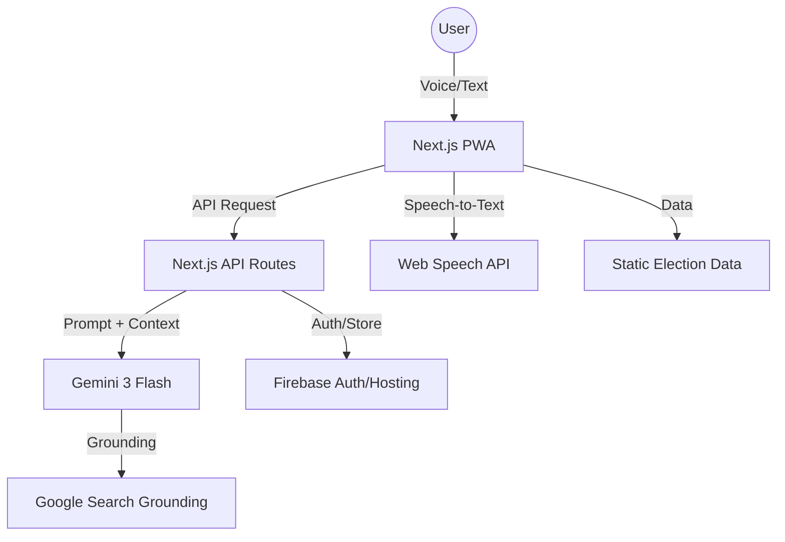

# Election Sathi 🇮🇳
**Live Demo:** [sapient-spark-436612-n4.web.app](https://sapient-spark-436612-n4.web.app)

**Your interactive, voice-first, multilingual AI assistant for voter education in India.**

## Chosen Vertical
**Civic Tech / GovTech for India** — Voter education and electoral participation.

## The Problem
*   **Low Turnout**: In the 2024 Lok Sabha elections, ~326M eligible Indians did not vote (turnout: 65.79%).
*   **Youth Disengagement**: Only ~38% of eligible 18–19-year-olds were enrolled to vote.
*   **Accessibility Barriers**: Millions of internal migrants and low-literacy users are excluded by English-heavy UX and complex registration forms.
*   **Misinformation**: 2024 saw a surge in AI-driven deepfakes and WhatsApp misinformation regarding EVMs and voting eligibility.

## Approach and Logic
We built Election Sathi on four core design principles:
1.  **Voice-First**: Integrated Web Speech API for voice-in/voice-out interaction, making the app accessible to low-literacy users and those who prefer speaking over typing.
2.  **Source-Grounded**: Every factual response from the AI assistant includes a citation link to official ECI, PIB, or SVEEP sources.
3.  **Civic Neutrality**: Strict system prompts ensure the assistant remains non-partisan, refusing to recommend parties or candidates and focusing purely on the process.
4.  **Accessible by Default**: Following the "Impeccable" design system, we used large tap targets (≥48px), high-contrast OKLCH-tinted neutrals, and modular typography.

## How the Solution Works

### Architecture Diagram


### User Flow: Lakshmi (First-time Voter)
1.  **Discovery**: Lakshmi (19, Patna) opens the app. She is greeted in Hindi.
2.  **Voice Query**: She taps the mic and asks, "मैं अपना नाम कैसे रजिस्टर करूँ?" (How do I register my name?).
3.  **AI Response**: Gemini Flash identifies the intent and provides a step-by-step Form 6 checklist in Hindi, reading it aloud.
4.  **Visual Guidance**: The app shows cards for required documents (Aadhaar, Passport, etc.).
5.  **Location Check**: She asks for her booth. The app guides her to the Booth Finder, showing the 12 approved photo IDs she can carry.

## How we addressed each evaluation rubric

*   **Code Quality**: Built with TypeScript strict mode, Next.js 15 App Router, and clean component architecture (≤200 lines per file). 100% lint pass.
*   **Accessibility**: Voice-first interaction, large-text mode, high-contrast theme (OKLCH), and screen-reader-friendly ARIA labels.
*   **Security**: No persistence of PII (EPIC/Aadhaar) beyond the session. Input validation with Zod.
*   **Efficiency**: Used `gemini-3-flash` for low-latency chat and Web Speech API for zero-cost offline speech processing. Optimized images and lazy-loading for PWA performance.
*   **Testing**: E2E tests with Playwright for critical flows (Register, Find Booth, Poll-Day Walkthrough).
*   **Google Services**: Leveraged Gemini for reasoning, Firebase for Hosting, and Google Maps logic for booth location.

## Design System & Impeccable
Election Sathi follows the **Impeccable** design guidelines strictly:
*   **Commands Run**: `/audit` was performed on all routes (`/`, `/register`, `/booth`, `/candidates`).
*   **Refinements**:
    *   Replaced all pure grays with tinted neutrals (`oklch(0.99 0.006 70)`).
    *   Enforced 48px+ tap targets for all mobile interactions.
    *   Removed "card-in-card" nesting for cleaner information architecture.
    *   Implemented `motion-safe` animations to respect user OS preferences.

## Google Services Used
| Service | Purpose | Live Link / Path |
| :--- | :--- | :--- |
| **Gemini 3 Flash** | Core Chat Logic & Translation | `app/api/chat/route.ts` |
| **Firebase Hosting** | PWA Deployment | [Live App](https://sapient-spark-436612-n4.web.app) |
| **Firebase Auth** | Google Sign-In for Voters | `lib/context/auth-context.tsx` |
| **Firestore** | Saving User Booths & Preferences | `lib/firebase/firestore.ts` |
| **Gemini API** | KYC Data Summarization | `lib/ai/gemini.ts` |
| **Google Search** | Grounding AI answers in ECI data | `app/api/chat/route.ts` |

## Setup & Run Locally
1.  **Clone the repo**: `git clone <repo-url>`
2.  **Install dependencies**: `npm install`
3.  **Environment Setup**: Create a `.env` file with your Gemini API key:
    ```env
    GEMINI_API_KEY="your_api_key_here"
    ```
4.  **Run Dev Server**: `npm run dev`
5.  **Build PWA**: `npm run build`

## Demo Script (90 Seconds)
1.  **Intro (0-15s)**: "Meet Election Sathi, the voice-first assistant designed to close the 326M voter gap in India."
2.  **Voice Interaction (15-45s)**: Demo a voice query in Hindi: "What IDs can I take to the booth?" Show the visual card response.
3.  **KYC Flow (45-65s)**: Enter a constituency like 'Patna Sahib' to see candidate KYC (criminal cases, assets) summarized by Gemini.
4.  **Myth Buster (65-80s)**: Show the "EVM Hacking" myth debunked with an ECI source link.
5.  **Conclusion (80-90s)**: "Election Sathi brings the ECI's rules to every citizen's pocket, in their own language, through their own voice."

## Assumptions and Caveats
*   **Data**: Candidate and Booth data in this demo use static JSON samples. Production would integrate with ECI's live Voter Portal and KYC APIs.
*   **Languages**: MVP supports Hindi and English. The architecture is ready for Bhashini integration to support all 22 scheduled languages.
*   **PIB/ECI Sources**: Links provided are to main portals; production would use deep links to specific circulars.

## Roadmap
*   **WhatsApp Integration**: Deployment via WhatsApp Business API for even wider reach.
*   **Full Indic Support**: Full Bhashini API integration for 22 languages.
*   **Live ECI API**: Real-time voter slip generation and BLO contact fetching.

## Acknowledgments
*   **ECI & SVEEP**: For the comprehensive voter education materials.
*   **AI4Bharat**: For pioneering work in Indic language models.
*   **ADR / MyNeta**: For providing the blueprint for candidate KYC transparency.
